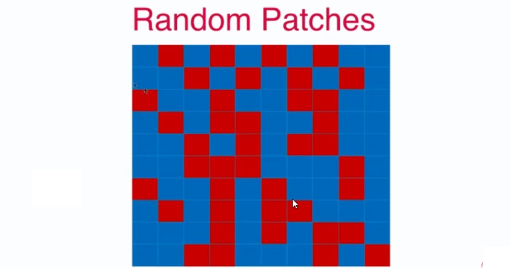

# 13-4 OOB(Out-of-Bag) 和关于 Bagging 的更多讨论

放回取样导致一部分样本很可能没有取到，平均大约有 37% 的样本没有取到。

不适用测试数据集，而使用这部分没有取到的样本做测试/验证。

`oob_score_`。

```python
from sklearn.tree import DecisionTreeClassifier # 决策树的子模型差异性将，这是集成学习喜欢的
from sklearn.ensemble import BaggingClassifier

# bootstrap=True 是放回取样
bagging_clf = BaggingClassifier(DecisionTreeClassifier(),
                               n_estimators=500, max_samples=100,
                               bootstrap=True, oob_score=True)

bagging_clf.fit(X, y)

bagging_clf.oob_score_
```

## 更多讨论

Bagging 的思路极易并行化处理。

`n_jobs`

```python
bagging_clf = BaggingClassifier(DecisionTreeClassifier(),
                               n_estimators=500, max_samples=100,
                               bootstrap=True, oob_score=True,
                               n_jobs=-1)

bagging_clf.fit(X, y)
```

## 差异化

针对特征进行随机采用 Random Subspaces。

既针对样本，又针对特征进行随机采用 Random Patches。

下图中，每一行代表一个样本，每一列代表一个特征。Random Patches（补丁）：



```python
random_subspaces_clf = BaggingClassifier(DecisionTreeClassifier(),
                               n_estimators=500, max_samples=500,
                               bootstrap=True, oob_score=True,
                               n_jobs=-1,
                               max_features=1, bootstrap_features=True)

random_subspaces_clf.fit(X, y)
random_subspaces_clf.oob_score_ # 0.822
```

```python

random_patches_clf = BaggingClassifier(DecisionTreeClassifier(),
                               n_estimators=500, max_samples=100,
                               bootstrap=True, oob_score=True,
                               n_jobs=-1,
                               max_features=1, bootstrap_features=True)

random_patches_clf.fit(X, y)
random_patches_clf.oob_score_ # 0.85
```

