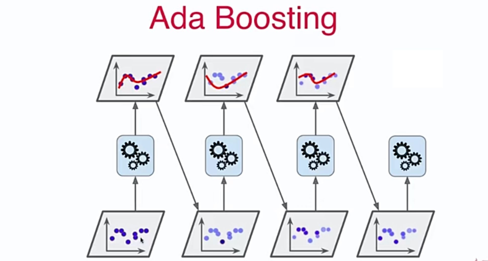
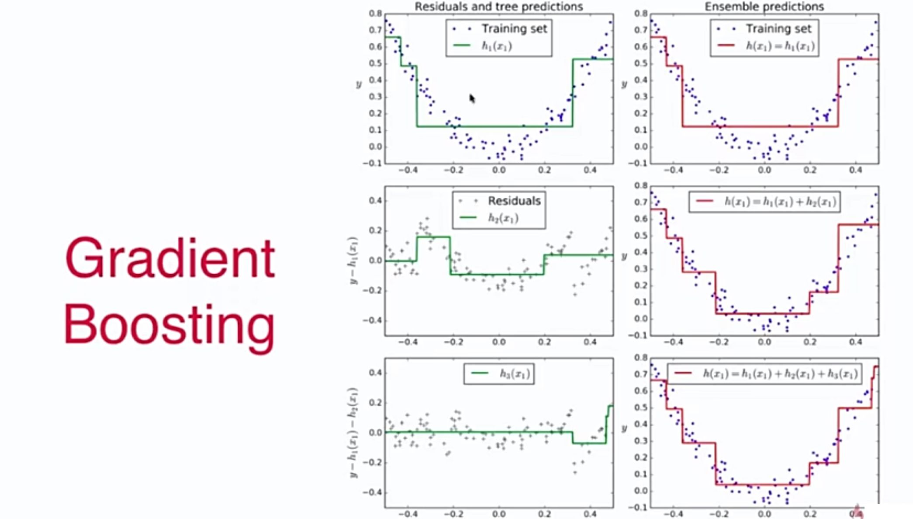

# 13-6 Ada Boosting 和 Gradient Boosting

Boosting

- 集成多个模型
- 每个模型都在尝试增强（Boosting）整体的效果。

Ada Boosting：每一个子模型都在弥补上一个子模型没有被成功预测的样本点，即每个子模型都在想办法推动（Boosting）上一个模型所犯的错误。

每个子模型都会认为某些样本重要，某些样本不重要。



```python
from sklearn.ensemble import AdaBoostClassifier
from sklearn.tree import DecisionTreeClassifier

ada_clf = AdaBoostClassifier(DecisionTreeClassifier(max_depth=2), n_estimators=500)
ada_clf.fit(X_train, y_train)
```

## Gradient Boosting

训练一个模型 m1，产生错误 e1；

针对 e1 训练第二个模型 m2，产生错误 e2；

针对 e2 训练第三个模型 m3，产生错误 e3；

……

最终预测结果是：m1 + m2 + m3 + ...



```python
from sklearn.ensemble import GradientBoostingClassifier

gd_clf = GradientBoostingClassifier(max_depth=2, n_estimators=30)
gd_clf.fit(X_train, y_train)
```


## Boosting 解决回归问题

```python
from sklearn.ensemble import AdaBoostRegressor
from sklearn.ensemble import GradientBoostingRegressor
```


