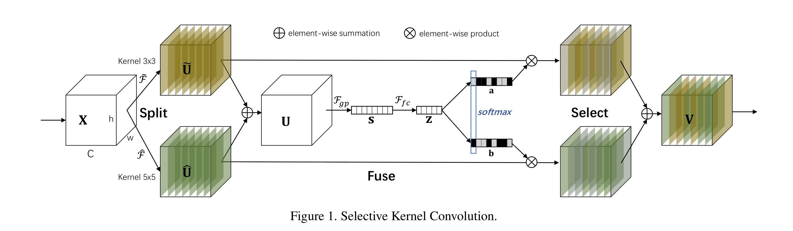
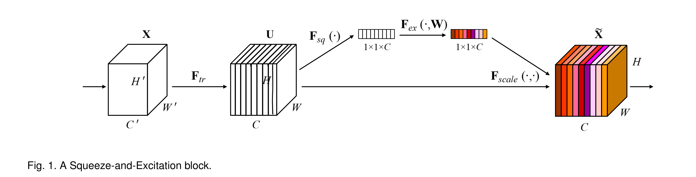
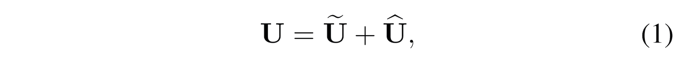
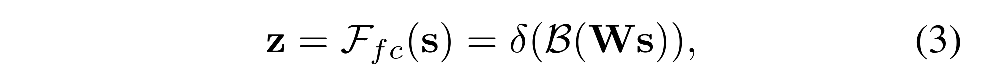
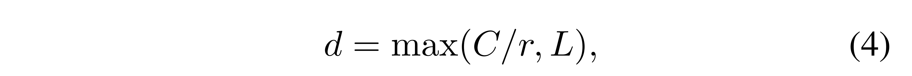
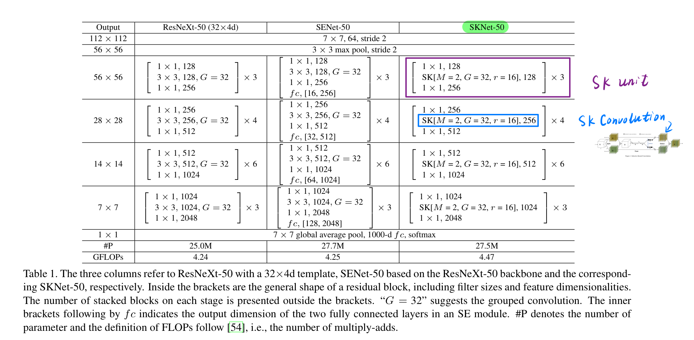

# Attention mechanism: SENet & SKNet

注意力机制论文阅读，第二次汇报的论文为：

- 下载地址：[（**SKNet**）Selective Kernel Networks (arXiv: 1903.06586)](https://arxiv.org/pdf/1903.06586.pdf)
- 发表时间（e-prints posted on arXiv）：2019 年 03 月.

## 0. 论文列表（已读一遍）

- Inside-Outside Net: Detecting Objects in Context with Skip Pooling and Recurrent Neural Networks (arXiv: 1512.04143)

- Spatial Transformer Networks (arXiv: 1506.02025)

- Residual Attention Network for Image Classification (arXiv: 1704.06904)

- ✅ （**SENet**）Squeeze-and-Excitation Networks (arXiv: 1709.01507)

  - > SENet brings an effective, lightweight gating mechanism to self-recalibrate the feature map via channel-wise importances.——SKNet 论文中对 SENet 的描述。

- Concurrent Spatial and Channel ‘Squeeze & Excitation’ in Fully Convolutional Networks (arXiv: 1803.02579)

  - > three variants of SE modules for image segmentation.

- CBAM: Convolutional Block Attention Module (arXiv: 1807.06521)

  - > Beyond channel, BAM [32] and CBAM [45] introduce **spatial attention** in a similar way.
    >
    > ——SKNet 论文中的描述。

- ✅ （**SKNet**）Selective Kernel Networks (arXiv: 1903.06586)

---

## 1. 解析 Selective Kernel Convolution

> SKNet：用 multiple scale feature 汇总的 information 来 channel-wise 地指导如何分配侧重使用哪个 kernel 的表征。
>
> - adaptively adjust their RF sizes. 自适应的调整其感受野的大小。
>
>

**SK 模块所做的工作**是：输入的特征图为 $X \in \mathbb{R}^{H' \times W' \times C'}$，**经过 SK Convolution** 后，得到输出的特征图为 $V \in \mathbb{R}^{H \times W \times C}$。SK 卷积有 3 个步骤：***Split, Fuse and Select***.

### 1.1 SK Convolution: *Split* (1/3)

对于输入的特征图 $X \in \mathbb{R}^{H' \times W' \times C'}$，默认情况下进行两次转换：

**（1）$\tilde{F}: X \rightarrow \tilde{U} \in \mathbb{R}^{H \times W \times C}$**

卷积核的大小为 $3 \times 3$。

**（2）$\hat{F}: X \rightarrow \hat{U} \in \mathbb{R}^{H \times W \times C}$**

卷积核的大小为 $5\times 5$。为了进一步提高效率，$5 \times 5$ 的卷积使用空洞大小为 2 的 $3 \times 3$ 的卷积来替代。

### 1.2 SK Convolution: *Fuse* (2/3)

Fuse 操作和 Squeeze and Excitation block 一样。

**（1）integrate information from all branches.**

将分支进行 element-wise 的求和，得到 $U \in \mathbb{R}^{H \times W \times C}$。

**（2）global average pooling.**

得到 $s \in \mathbb{R}^{C \times 1}$，s 是一个有 C 个元素的列向量。

**（3）compact feature by simple fully connected (fc) layer.**

使用全连接层，即 $s \in \mathbb{R}^{C \times 1} \rightarrow z \in \mathbb{R}^{d \times 1}$，其中 $d < C$。

- $\delta$ 使用 ReLU 函数，
-  $B$ 表示 Batch Normalization，
- $W \in \mathbb{R}^{d \times C}$，权重矩阵。

- reduction ratio $r$ 是一个超参数，
- 一般设置 L = 32。

### 1.3 SK Convolution: *Select* (3/3)

这一步是 SK Block 的核心操作。

> A **soft attention across channels** is used to adaptively select different spatial scales of information, which is guided by the compact feature descriptor z.

（1）Soft attention across channels.

- $A, B \in \mathbb{R}^{C \times d}$，这两个矩阵也是端到端训练出来的。如果只有两个分支，那么矩阵 B 是冗余的，因为 Softmax 的输出 $a_c + b_c = 1$，可以通过 1 减去另一个得到。
- $z \in \mathbb{R}^{d \times 1}$，经过 softmax 操作后，得到的 $a \in \mathbb{R}^{C \times 1}$.
  - z 被称为 compact feature descriptor.
  - a 被称为 soft attention vector.

（2）The final feature map $V$ is obtained through the **attention weights** on various kernels.

- $\tilde{U}, \hat{U} \in \mathbb{R}^{H \times W \times C}$
- $a, b \in \mathbb{R}^{C \times 1}$
- 执行的操作是 element-wise product.  $a_c \cdot \tilde{U}_c$ 表示第 c 个通道的特征图上的每个点，都乘以数 $a_c$。

综上，就是 SK Convolution 的内部原理细节。

## 3. 实验

SK Convolution $\rightarrow$ SK unit $\rightarrow$ ==SK Networks==.

### 2.1 *Selective Kernel (SK) Convolution* (1/3)

### 2.2 *Selective Kernel (SK) unit* (2/3)

### 2.3 *Selective Kernel (SK) Networks* (3/3)

## 3. Notes

SK Block 在检测问题中没有显著效果。

