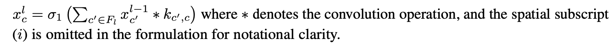
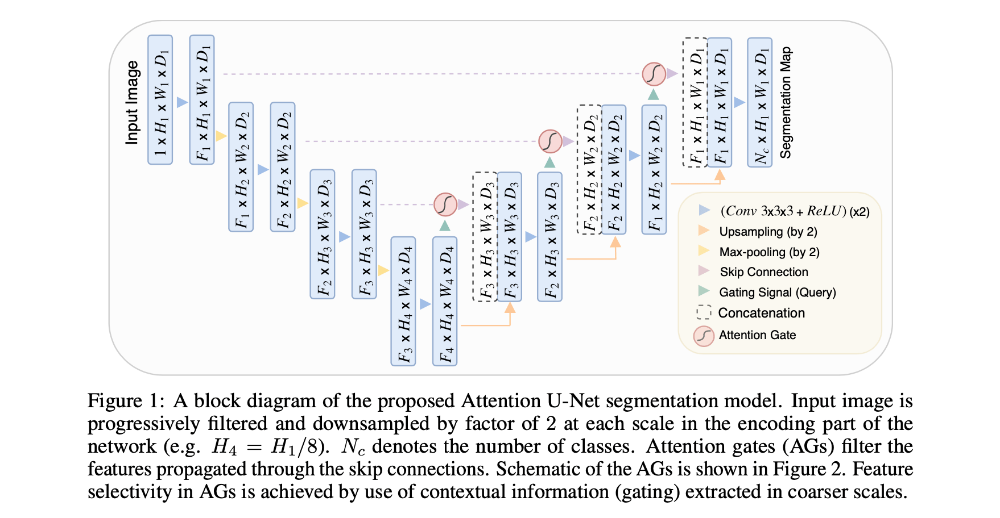
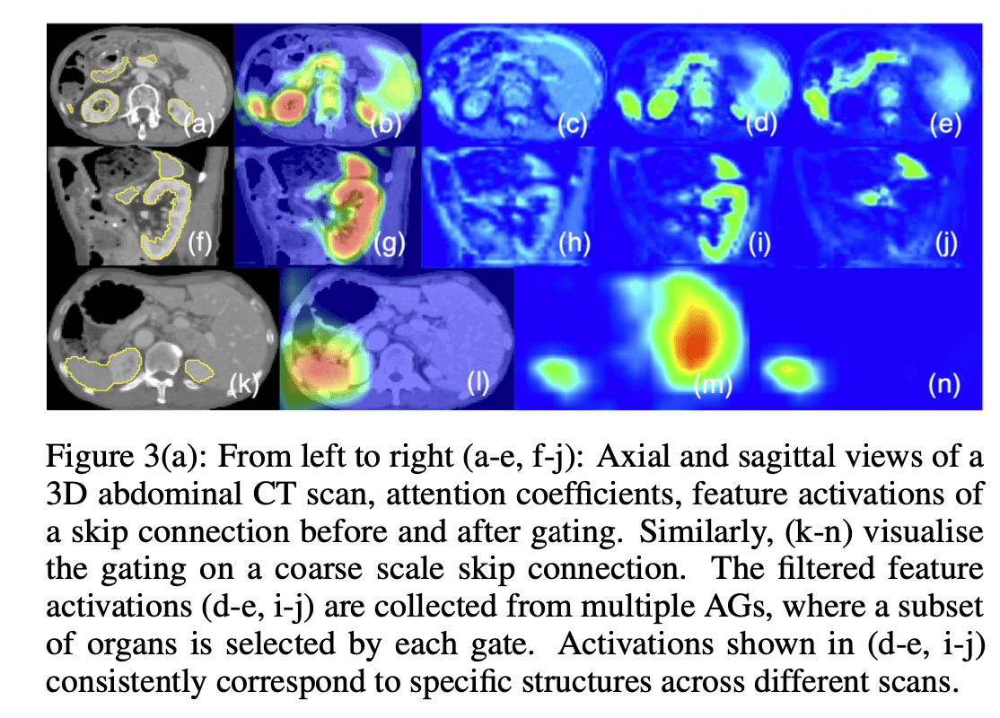
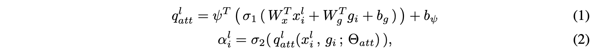
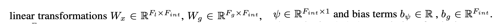
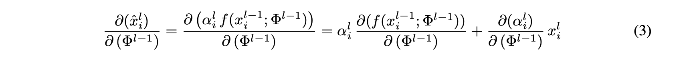

# 论文阅读 Attention U-Net: Learning Where to Look for the Pancreas

arXiv:1804.03999

Pancreas（胰腺）

## Abstract

论文提出了一种新型的注意力门（Attention Gate, AG）模型，用于医学成像，自动学习关注不同形状和大小的目标结构。AG 使得级联卷积神经网络能够明确的**定位**外部组织/器官。AG 更够整合到到标准的 CNN 结构（如 U-Net），以最小的计算开销，同时提高模型的灵敏度和预测精度。

在两个大型的 CT abdominal datasets 上，AG 持续改善 U-Net 的预测性能。

## 1 Introduction

随着卷积神经网络（CNN）的出现，在自动化医学图像分析任务中，包括心脏 MR 分割和肺癌结节检测，可以实现接近放射科医生水平的性能。

完全卷积网络（FCN）和 U-Net 是两种常用的架构。这种基本的 CNN 架构存在一个问题，当目标器官在形状和大小方面显示出较大的患者间差异时，这些架构依赖于多阶段级联 CNN（即一个模型用于定位，一个用于分割，等读个阶段级联）。但是，这种方法会导致计算资源和模型参数的过度和冗余使用（例如，类似的低级特征被级联内的所有模型重复提取）。

为了解决这个问题，论文提出了有效的解决方案，命名为 attention gates (AGs)。

这些门不会引入大量的计算开销，能够突出对特定任务有用的特征，抑制不相关区域的特征激活，提高了密集标签预测的模型灵敏度和准确性。

有了 AG，就可以在保持高预测精度的同时，注意力系数特定于局部区域，不再需要使用外部器官定位模型。

AG 与标准 U-Net 架构结合，形成 Attention U-Net，应用于医学图像。在 CT 胰腺分割问题中，AG的引入在不同的数据集和训练规模上一致提高了预测精度，同时，在不需要多个 CNN 模型的情况下实现了 SOTA。

### 1.1 Related Work

**（1）胰腺 CT 分割（CT Pancreas Segmentation）**

早期的时候，对于这个任务采用的技术是 statistical shape models 或 multi-atlas techniques（多图谱技术）。

级联多级 CNN 模型（multi-stage CNN models），用于消除图谱所存在的一些问题。也就是说，一个初始的粗层次模型（如 U-Net 或回归森林）被用于获得 ROI（感兴趣的区域），然后裁剪后的 ROI 被第二个模型用于分割细化。类似的还有利用 2D-FCN 和循环神经网络（RNN）模型的组合。

如果不使用级联框架，性能会下降 2.0% 到 4.4%。最近的工作中，有人提出了一个迭代的两阶段模型，递归更新局部和全局预测，并且两个模型都是端到端训练的。

**（2）Attention Gates**

AG 在自然图像分析、知识图谱和语言处理（NLP）中常用于图像字幕、机器翻译和分类任务。

最初的工作是通过解释输出类分数相对于输入图像的梯度来探索注意力图谱。而可训练的注意力则是通过设计强制执行的，分为硬注意力和软注意力（ hard- and soft-attention）。

SENet 使用通道注意力来突出重要的特征维度，这在 ILSVRC 2017 图像分类挑战赛中取得了冠军。

### 1.2 Contributions

提出 self-attention gating module，这个方法的贡献如下：

（1）注意力系数更具体到局部区域，与基于全局特征向量的门控相比，提高了性能。

（2）提出了一个应用于医学成像任务的前向 CNN 模型中的软注意技术的第一个用例。

（3）对标准的 U-Net 模型提出了一个扩展，提升了 U-Net 模型的精度。

## 2 Methodology （没有理解！！！）

**Fully Convolutional Network (FCN)** 

FCN 在基准数据集上优于传统方法，且比 graph-cut and multi-atlas segmentation techniques 快一个数量级。这主要得益于：

（1）使用随机梯度下降（SGD）优化方法

（2）参数共享

（2）图像卷积运算很好地利用了医学图像中的结构信息。

$x^l$ 表示逐层卷积后提取到的高维度的特征图，最终，这将在高维空间中根据其语义分离出像素。$x^l$ 是第 l 层的输出，是依次进行线性和非线性变化得到的。经常选择的是 rectified linear unit：$\sigma_1(x^l_{i, c}) = max(0, x^l_{i, c})$。

- i 和 c 分别代表的是空间和通道维度。

特征激活可以表述为：

可训练参数通过最小化训练目标来学习。

本篇论文的工作是在标准的 U-Net 架构之上建立了注意力模型。

U-Net 由于其良好的性能和对 GPU 内存的高效利用，被普遍用于图像分割任务。后者的优势主要与多图像尺度下的图像特征提取有关。粗特征图可以捕获上下文信息，并突出前景对象的类别和位置。多尺度下提取的特征图之后通过跳过连接进行合并，结合粗级和细级密集预测。如 Figure 1 所示：

> 图 1：提出的 Attention U-Net 分割模型的框图。输入图像在网络的编码部分的每一个尺度上被逐步过滤和下采样系数为 2（例如 H4=H1/8）。Nc 表示类的数量。注意力门（AGs）过滤通过跳过连接传播的特征。AGs 的示意图如图 2 所示。AGs 中的特征选择性是通过使用在较粗尺度中提取的上下文信息（门控）来实现的。

**Attention Gates for Image Analysis:**

为了捕获足够大的感受野，从而捕获语义上下文信息，在标准的 CNN 架构中，特征图被逐渐下采样。通过这种方式，空间上的特征在全局尺度上模拟了组织之间的位置和关系。然而，对于形状变化较大的小物体，仍然难以减少假阳性预测（false-positive）。

为了提升精度，目前的分割框架依赖于额外的对象定位模型，将任务简化为独立的定位和后续分割步骤。

本篇论文通过在标准 CNN 模型中集成注意力门（AG）可以实现同样的目标，不需要训练多个模型和大量的额外模型参数。与多阶段 CNN 中的定位模型相反，AG 逐步抑制不相关背景区域的特征响应，而不需要在网络之间裁剪 ROI。

注意力系数：$\alpha_i \in [0, 1]$，识别突出的图像区域，并修剪特征响应，以只保留与特定任务相关的激活。如 Figure 3(a)。

> 图 3(a)。从左到右（a-e，f-j）。三维腹部 CT 扫描的轴线和矢状视图， 注意力系数，特征激活的跳过连接 前和后的门控。同样，（k-n）可视化的粗尺度跳过连接上的门控。过滤后的特征激活（d-e，i-j）是从多个AG收集的，其中一个器官的子集是由每个门选择。在（d-e，i-j）中显示的激活一致对应于不同扫描的特定结构。

注意力门 AG 的输出是输入特征图和注意力系数的元素乘法：$\hat{x}^{l}_{i,c} = x^{l}_{i,c} \cdot a^{l}_{i}$。在默认设置中，对每个像素向量 $x^{l}_{i} \in \mathbb{R}^{F_l}$ 计算一个标量注意力值，其中 $F_l$ 对应于层 $l$ 中特征图的数量。

在多语义类的情况下，提出了学习多维度的注意力系数。

Figure 2，门向量 $g_i \in \mathbb{R}^{F_g}$ 用于每个像素 i 确定注意区域。

> 图 2：提出的加法注意力门（AG）的示意图。输入特征 ($x^l$) 与 AG 中计算的注意力系数 ($\alpha$) 进行缩放。空间区域是通过分析激活和上下文信息提供的门控信号( g )，这是从一个更粗的规模收集的选择。注意力系数的网格重采样是用三线插值法完成的。

门控向量包含上下文信息，使用加法注意力来获得**门控系数**。加法注意力在计算上比较昂贵，但实验表明它比乘法注意力获得了更高的精度。如下式子计算得到**注意力系数**：

- $\sigma_2$ 就是 Sigmoid 激活函数

AG 的特点是由一组参数 $\theta_{att}$ 组成：

linear transformation 是通过对输入向量进行 channel-wise 1x1x1 卷积计算得到。在其他情况下，这被称为 *vector concatenation-based attention*。concatenated 特征 $x_l$ 和 g 被线性映射到 $\mathbb{R}^{F_{int}}$ 维度的中间空间。

在图像标题和分类任务中，使用 softmax 激活函数来归一化注意力系数 ($\sigma_2$)。然而，连续使用 softmax 会在输出端产生更稀疏的激活。为此，选择 sigmoid 激活函数，在实验上能够使得 AG 参数有更好的训练收敛性。

AG 参数可以通过标准的反向传播更新进行训练。

**Attention Gates in U-Net Model**

从粗尺度中提取的信息用于门控，以消除跳过连接中的不相关和噪声响应。这是在连接操作之前进行的，以合并相关的激活。此外，AGs 过滤神经元激活在前向传递以及在后向传递。源自背景区域的梯度在后向传递时被降权。这使得浅层中的模型参数主要基于与给定任务相关的空间区域进行更新。第 $l-1$ 层卷积参数的更新规则如下：

- 右侧的第一个梯度项是用 $a^l_i$ 来缩放的。

- 右侧第二项中，$x^l_i = f(x^{l-1}_i; \Phi^{l-1})$

## 3 Experiments and Results

AG 是一个模块，可以很容易地适应分类和回归任务。

由于形状变化和组织对比度差，胰腺的边界划分是一个困难的任务，

Evaluation Datasets：

- （1）从诊断为胃癌的患者中获取 150 张腹部三维 CT 扫描片（CT-150）。
- （2）第二个数据集（CT-82）由 82 个对比度增强的三维 CT 扫描与胰腺手动注释逐片进行。

Implementation Details：

-  3D-model to capture sufficient semantic context.
- 

