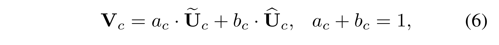

# （SKNet）Selective Kernel Network 解析

昨天晚上的课题组组会我汇报的很不理想，因此今天我想再写一篇笔记。

这个笔记的内容是我想要表达的东西。

---

## 我与 SKNet 结缘？

Selective Kernel Network 是注意力机制的一篇经典文献。

其实我现在的论文阅读量不多，连基础的基干系列网络都还没看完，但是为什么跑到注意力机制这里来了呢？

是这样的，在我之前的汇报过的论文中，有 AlexNet、VGG、Xception，我进入注意力机制里，就是从 Xception 开始的。

Xception 基于“卷积神经网络的特征图中的跨通道相关性和空间相关性的映射平可以完全解耦” 这一假设，提出了一种完全基于深度可分离卷积层的卷积神经网络架构。

下图 Figure 1~Figure 4 都是来自 Xception 的论文。

> Chollet, F. (2016). Xception: Deep Learning with Depthwise Separable Convolutions (cite arxiv:1610.02357)

Figure 1 是经典的 Inception block；Figure 2 是其一个简化版本；Figure 3 是 1×1 卷积（通道维度 ）后，在输出通道的**非重叠段**上卷积（空间维度），注意这个【非重叠】，加粗了。非重叠，意味着通道的分段。

观察 Figure 3 之后，自然而然地提出了一个问题：对于输出的通道，分段的段数有什么影响？

Figure 4 这就是 Inception 的一个极端的结构（Extreme Inception），即：1×1 卷积之后，**有多少个通道就分成多少段**，，均分，3×3 的通道数都是 1，进行非重叠卷积。

所以，我一直对段数到底应该怎么分有一个疑惑。比如，能不能不均分？就是说每个 3×3 卷积时的通道数都可能是不同的，那就有很多种组合。

从这里出发，我就找到了 SENet。

> Hu, J., Shen, L., & Sun, G. (2018). Squeeze-and-Excitation Networks. *2018 IEEE/CVF Conference on Computer Vision and Pattern Recognition*, 7132-7141.

但是 SENet 依旧没有解决我的问题。

SENet 是这样的，它仍然和 Xception 有类似思想，有多少通道数，就分成多少段（global average pooling），然后通过注意力机制，使得每个通道的重要性程度不一样。

也就是说，通过 SE block 之后，特征图每个通道的重要性程度就不再相同了。重要的信息被强调，不重要的信息就被弱化，进而提升网络的性能。

看完了 SENet，心中疑惑仍在：1×1卷积后得到的特征图，按照通道数应该分成多少段？哪些核应该分到多点的通道？哪些核应该分到少一点的通道？

SKNet 是 SENet 的孪生兄弟（作者说的），SKNet 的起名也是致敬了 SENet。既然是兄弟，有始有终，就顺便把 SKNet 给看了。

> Li, X., Wang, W., Hu, X., & Yang, J. (2019). Selective Kernel Networks. *2019 IEEE/CVF Conference on Computer Vision and Pattern Recognition (CVPR)*, 510-519.

我与 SKNet 就这样相识了。

下面，是我对 SKNet 的解析。

## 背景

在开始介绍 SKNet 之前，先来了解一下这篇论文是在一个什么样的背景下出现的。

在神经科学领域，视觉皮层的神经元的感受野大小是受刺激调节的。但是，这一点在 CNN 中很少被考虑到。如下图，神经元一般拥有着固定的感受野大小。

<https://towardsdatascience.com/advanced-topics-in-deep-convolutional-neural-networks-71ef1190522d>

在视觉皮层中，同一区域中神经元的感受野大小是不同的，这使得神经元可以在同一处理阶段收集多尺度的空间信息。什么是多尺度？下图就表示一个目标对象的不同尺度。

也就是说，视觉皮层中的神经元可以**捕获具有不同比例的目标对象，根据输入自适应地调整其感受野大小。**

虽然在此之前，自适应感受野大小的机制还没有人提出，或者说很少被考虑到。但是有一点是存在共识的，那就是结合不同感受野大小能够提升神经元的适应能力。

“结合不同感受野大小”，让神经元可以在同一处理阶段收集多尺度的空间信息的机制，已经被广泛采用了。

InceptionNet 就是一个典型例子。它通过设计一个简单的级联（concatenation）来聚合来自内部 1×1、3×3、5×5、7×7 卷积核的多尺度信息。

> Szegedy, C., Liu, W., Jia, Y., Sermanet, P., Reed, S.E., Anguelov, D., Erhan, D., Vanhoucke, V., & Rabinovich, A. (2015). Going deeper with convolutions. *2015 IEEE Conference on Computer Vision and Pattern Recognition (CVPR)*, 1-9.

但是 Inception 存在一个缺点：它虽然考虑到了神经元需要不同尺度的信息，但是它不同分支的多尺度信息的聚合方法比较简单，机制固定，可能还不足与为神经元提供强大的适应能力。

而且，Inception module 结构非常复杂，人工的痕迹太重了。

“复杂的东西往往抓不到背后的本质！”

Inception(GoogLeNet) 的提出时间为 2014 年 9 月（arXiv），正是发表是在 2015 年。

VGG 在 arXiv 上的时间也是 2014 年 9 月份。

> Simonyan, K., & Zisserman, A. (2015). Very Deep Convolutional Networks for Large-Scale Image Recognition. *CoRR, abs/1409.1556*.

那个时候，还没有 “He Initialization”，也没有 “Batch Normalization”，ResNet 还没有提出。神经网络面临一个普遍的问题，随着网络的加深，越来越难以训练，而且存在网络退化的问题。

InceptionNet 就是让网络变得“胖”一些。

第二年 ResNet 横空出世，一下子就把网络的深度加深到了上千层。

> He, K., Zhang, X., Ren, S., & Sun, J. (2016). Deep Residual Learning for Image Recognition. *2016 IEEE Conference on Computer Vision and Pattern Recognition (CVPR)*, 770-778.

ResNet 发布后，Inception 从 ResNet 获得灵感，第二年 Inception-ResNet 发布。

后来，单路卷积变成了多个支路的多路卷积，分组数很多，结构一致，进行分组卷积，ResNeXt 诞生。

> Xie, S., Girshick, R.B., Dollár, P., Tu, Z., & He, K. (2017). Aggregated Residual Transformations for Deep Neural Networks. *2017 IEEE Conference on Computer Vision and Pattern Recognition (CVPR)*, 5987-5995.

上图中，(a) 是 ResNeXt 基本单元，如果把输出那里的 1×1 合并到一起，得到等价网络 (b) 拥有和 Inception-ResNet 相似的结构，而进一步把输入的 1×1 也合并到一起，得到等价网络 (c) 则和通道分组卷积的网络有相似的结构。

这幅图相当于在说，Inception-ResNet 和通道分组卷积网络，都只是 ResNeXt 这一范式的特殊形式而已。

“ResNeXt 抓住了背后的本质。”

做了一个小总结：

- InceptionNet 的特点是多分支的 multiple Kernel 设计
- ResNeXt 的特点是用分组卷积轻量化了 >1× 1 的 kernel

在此背景之下，SKNet 设计的出发点就是能否结合两者的特色。

## SKNet 设计的出发点

SKNet 设计的一大出发点就是结合 Inception&ResNeXt 的优点，改进其缺点。

首先，先把 InceptionNet concatenation 汇聚的过程灵活化。目前流行的注意力机制就可以做到这一点。

原始的 ResNeXt block 对于不同尺度的目标对象输入，无法获得不同尺度的信息。因此，在 ResNeXt 的基础之上，引入类似 Inception block 的多分支机构。就像下图这样，有 4 个分支（后续实验表明，分支数为 2 就好了，分支数太多参数量、计算量太大）。

引入，我得出的总结为：**在 ResNeXt block 的基础之上，加上多分支和 Attention 机制，就得到了 SK block。**

## 解析 Selective Kernel Unit（SK block）

 **SK 模块所做的工作**是：输入的特征图为 $X \in \mathbb{R}^{H \times W \times C}$，**经过 SK Convolution** 后，得到输出的特征图为 $V \in \mathbb{R}^{H \times W \times C}$。SK 卷积有 3 个步骤：***Split, Fuse and Select***.

### 1 SK Convolution: *Split* (1/3)

对于输入的特征图 $X \in \mathbb{R}^{H \times W \times C}$，默认情况下进行两次转换：

**（1）$\tilde{F}: X \rightarrow \tilde{U} \in \mathbb{R}^{H \times W \times C}$**

卷积核的大小为 $3 \times 3$。

**（2）$\hat{F}: X \rightarrow \hat{U} \in \mathbb{R}^{H \times W \times C}$**

卷积核的大小为 $5\times 5$。为了进一步提高效率，$5 \times 5$ 的卷积使用空洞大小为 2 的 $3 \times 3$ 的卷积来替代。

### 2 SK Convolution: *Fuse* (2/3)

Fuse 操作和 Squeeze and Excitation block 一样。

**（1）integrate information from all branches.**

将分支进行 element-wise 的求和，得到 $U \in \mathbb{R}^{H \times W \times C}$。

**（2）global average pooling.**

得到 $s \in \mathbb{R}^{C \times 1}$，s 是一个有 C 个元素的列向量。

**（3）compact feature by simple fully connected (fc) layer.**

使用全连接层，即 $s \in \mathbb{R}^{C \times 1} \rightarrow z \in \mathbb{R}^{d \times 1}$，其中 $d < C$。

- $\delta$ 使用 ReLU 函数，
- $B$ 表示 Batch Normalization，
- $W \in \mathbb{R}^{d \times C}$，权重矩阵。
- z 被称为 compact feature descriptor.

- reduction ratio $r$ 是一个超参数，
- 一般设置 L = 32。

### 3 SK Convolution: *Select* (3/3)

这一步是 SK Block 的核心操作。

> A **soft attention across channels** is used to adaptively select different spatial scales of information, which is guided by the compact feature descriptor z.

（1）Soft attention across channels.

- $A, B \in \mathbb{R}^{C \times d}$，这两个矩阵也是端到端训练出来的。如果只有两个分支，那么矩阵 B 是冗余的，因为 Softmax 的输出 $a_c + b_c = 1$，可以通过 1 减去另一个得到。
- $z \in \mathbb{R}^{d \times 1}$，经过 softmax 操作后，得到的 $a \in \mathbb{R}^{C \times 1}$.
  - z 被称为 compact feature descriptor.
  - a 被称为 soft attention vector.

（2）The final feature map $V$ is obtained through the **attention weights** on various kernels.

- $\tilde{U}, \hat{U} \in \mathbb{R}^{H \times W \times C}$
- $a, b \in \mathbb{R}^{C \times 1}$
- 执行的操作是 element-wise product.  $a_c \cdot \tilde{U}_c$ 表示第 c 个通道的特征图上的每个点，都乘以数 $a_c$。

综上，就是 SK Convolution 的内部原理细节。

## SKNet 结构

SKNet 建立在 ResNeXt 的基础之上，把 ResNeXt 中 3×3 的核全部换成 SK Unit，这就得到了 SKNet。

有两个多出来的超参数。

M=2 表示分支数为 2。

r 这个参数是用来调节 Fuse 中全连接层的参数个数的。在 Fuse 操作中，全局平均池化之后，得到向量 s，然后通过一个全连接层后得到向量 z，z 的通道数是小于 s 的，超参数 r 就是用来控制这个的。

## 实验结果

Table 2~5 都是描述的 SKNet 与其他模型的比较结果。对 SKNet 只要有一个印象就行，与其他模型相比：

- 同等参数量下，SKNet 的 top-1 错误率最低！
- 同等 top-1 错误率下，SKNet 的参数量最少！

重点放在 Ablation Studies 上。

**（1）Table 6**

表中 D 是空洞卷积的空洞大小，能在在不增加计算量的情况下，扩大感受野。

SKNet 中，Split 操作有一分支是 3×3，另一分支是 5×5。对于 5×5 的支路，使用空洞大小为 2 的 3×3 卷积来替代。Table 6 说明了这样做的优势。

各种 3×3 kernels with various dilations 明显优于与它具有相同感受野的 kernel。3×3, D=3 优于 7×7, D=1。

（这只在 SKNet 分支中使用才成立，在其他地方使用就不好说了，Table 7 就是例子）

**（2）Table 7.**

前面的三栏是空洞卷积的知识，在不增加计算量的情况下增加感受野。表中可以得出结论，单纯的使用这种卷积虽然增大了感受野，但是 top-1 错误率却提升了。第一栏就是 ResNeXt 的精度。因此，空洞卷积它不能乱用！在 SK 块外使用就不行！

关于空洞卷积的使用场景，这里我留一个 Flag，后面再看。

- 对于两条分支的 SK 卷积聚合始终比简单的聚合方法的 top-1 错误率更低。（SK:20.79%, 普通的 concat: 21.76%）
- (K3, K7)(K5, K7) 也是一样的，SK卷积聚合性能更优。稍微不可避免的增加了一点点的计算量。
- SK Unit 随着分支数的增加，M=2 增到 M=3，top-1 错误率下降了。这也是以增加一定的参数量和计算量为代价的。
- M=2，M=3 的 top-1 错误率差不多（20.79%，20.76%）。为了更好的平衡模型的性能和复杂度，M = 2 是更好的选择（两路分支）。

**（3）Figure 3.**

Figure 3 特别有意思，我认为这是这篇文献的一个重点。

一般来说，对于这种花里胡哨的图，脑海中不多的经验告诉我，这都是用来研究一个问题的，即神经网络的可解释性研究！

下面我将用两个问题来总结这些图片想要说明的事情。（1）这些图做了什么事情？或者说为什么要画这些图？（2）这些图可以得出什么结论？ 

首先来看问题（1）为什么要画这些图？

对于我来说，看完前面的实验结果（Table 2~Table5），我就知道了一件事：SKNet 非常厉害！它为什么厉害，我不知道。

再回忆一下这篇论文的背景，它的提出是用来解决一个什么问题的？

SKNet 解决的是：对于不同尺度的目标对象输入，SKNet 能够实现自适应感受野大小，进而提升性能。

所以，这些花里胡哨的图是用来说明，对于不同尺度的目标对象输入，网络中的不同感受野的卷积核的权重是动态变化的，即自适应感受野大小。SKNet 所带来的性能提升，是自适应感受野大小的结果。

好的，第一个问题解决。

来看第二个问题，（2）这些图可以得出什么结论？

(a)(b) 两图的折线图，取了 SK_3_4 阶段的 soft attention vector b 进行可视化。b 向量是分支 5×5 分支的注意力权重。

> 至于为什么选择 SK_3_4，这是因为通过实验发现，SK_3_4 最能体现，当目标对象增大（1.0×、1.5×、2.0×），大核（5×5）的注意力权重增大。

以两个随机的样本为例，对于大多数通道，当目标对象增大（1.0×、1.5×、2.0×），大核（5×5）的注意力权重增加，图上的体现就是，红线大部分位于蓝绿两线之上。

接下来看条形图。

分两段看：2_3、3_4、4_6 是一个段，这是网络的前层和中间一点的层；5_3 是另一个段，表示为网络的很深的层。前一段呈现了这样一个现象：目标对象越大，则在网络浅层和中层阶段（例如，SK2_3，SK3_4, SK 4_6），“Selective Kernel” 机制将增加大核（5×5）的注意力权重，体现在条形图上就是：2.0× 的粉色 > 1.5× 绿色 > 1.0× 蓝色。

后一段 SK 5_3 深层就没有这个规律了。(b) 图的 5_3，目标对象从 1.0× 放大到 1.5×，核 5×5 的注意力权重反而减少了，而从 1.5× 放大到 2.0×，5×5 核的注意力权重却又增加了。

(c) 图表明，对于所有的验证集数据，都呈现出一样的现象。

最后来回答第二个问题（2）这些图可以得出什么结论？

得出的结论：目标对象从 1.0x 增加到 1.5x、2.0x，5x5 大核的重要性增加了！

如果要加上一个定语的话，那就是，只限于在网络的浅层和深层，在深层没有这种现象。

**（4）Figure 4.**

Figure 图可以得到以下结论：

- 在 SK_2_3 和 SK_3_4 阶段（网络的浅层和中间一点的层），随着目标对象的放大（1.0× 增大到 1.5×），5×5  核的重要程度随着增加。

（浅层和中层橙色线始终位于蓝色线之上）

- 在网络的深层，目标对象的放大（1.0× 增大到 1.5×），橙色线和蓝色线是上下交错的，这表明 5×5 核的重要程度和不同尺度的目标对象相关性不强。

深层没有浅层的那种规律现象。作者也对这个现象进行了解释：深层的特征中的多尺度信息已经被分解掉了，所以对于 1.0x、1.5x 的目标对象，SKNet 没有明确的倾向去选择更大或更小的 kernel。

## 总结

最后对 SKNet 进行一个总结：

- SKNet 从多种卷积核中聚集信息，以实现神经元的自适应感受野大小。
- SKNet 是第一个通过引入注意力机制来明确关注神经元的自适应感受野大小。
- 设计思路：ResNeXt + Inception + SENet ≈≈ SKNet

实验发现，

（1）SKConvolution 的大于 3×3 分支中，各种 3×3 kernels with various dilations 明显优于与它具有相同感受野的 kernel。例如：3×3, D=3 优于 7×7, D=1。

（2）随着目标对象尺度的增大（1.0×、1.5×、2.0 × ），在前网络的浅/中层，感受野大的核的重要性增大。

（3）在网络的深层，特征中的多尺度信息会被分解，所以对于 1.0×、1.5×、2.0× 等不同尺度的目标对象，SKNet 没有明确的倾向去选择更大或更小的 kernel。

以上，就是昨天晚上的汇报，我想要表达的所有内容。

