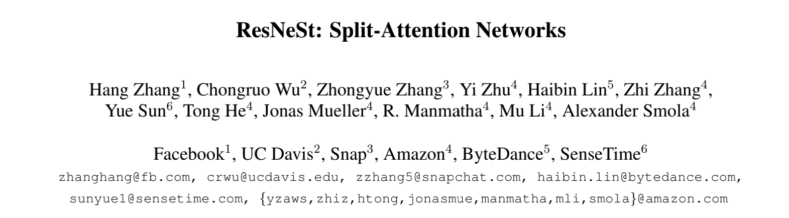
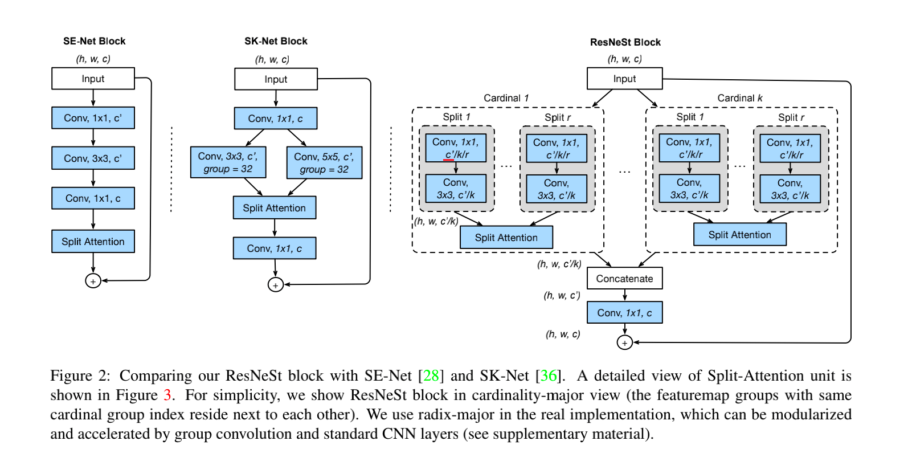
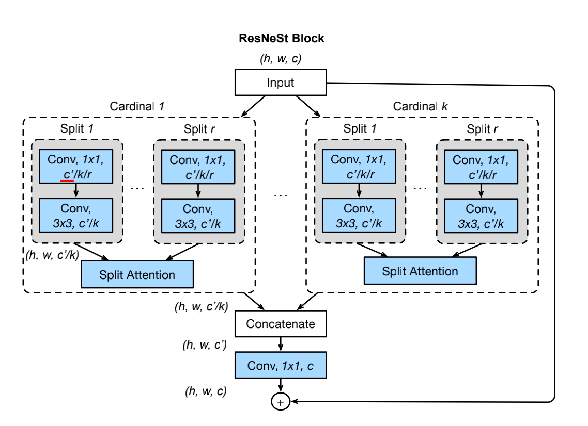

# ResNeSt

- arXiv: 2004.08955

可以看到，这是一篇 2020 年 4 月份发布的文章。

## Abstract

在视觉识别任务中，有两项非常重要：

- featuremap attention（SENet，通道注意力、空间注意力等等）
- multi-path representation（InceptionNet 多分支结构）

这篇论文提出了一种模块化的架构，将**通道注意力应用在了不同分支上**。

模型被命名为 ResNeSt，在图像分类的准确性和延迟权衡方面优于 EfficientNet。（EfficientNet, arXiv: <https://arxiv.org/abs/1905.11946>）

## 1 Introduction

卷积核：卷积层学到了一组**卷积核**，它将空间（spatial）和通道（channel）的邻域信息聚合在了一起。

Inception：**Inception** module 通过不同的卷积滤波器组进行变换，然后合并（concatenation）。

SE-like 通道注意力机制：通过全局池化（global polling）来挤压（Squeeze）空间维度，并预测出一组注意力因子（attention factors ），再与原始特征图进行通道乘法。

这种注意力机制利用全局上下文信息有选择地强调或弱化特征。这类似于人类初级视觉皮层的注意选择阶段，即寻找信息部分来识别物体。

这种策略很容易在神经感知系统中识别出相似物体的细微但显性的差异。

本篇论文的架构将通道注意力策略和多分支网络相结合。

通过在 ResNet 风格的网络中，堆叠 Split-Attention Block，就创建了一个新的 ResNet 变体：Split-Attention Netw (ResNeSt)。这个大写的 S，表示的就是 Split。

在 ImageNet、object detection, instance segmentation and semantic segmentation 等基本数据集上都进行了测试。

## 2 Relate Work

**(1) CNN Architectures:**

- AlexNet
- Network in Network: first uses a **global average pooling layer** to replace the heavy fully connected layers, and adopts 1×1 convolutional layers to learn non-linear combination of the featuremap channels, which is the **first kind of featuremap attention mechanism**. （第一个注意力机制）
- VGG-Net:  stacking the same type of network blocks repeatedly
- Highway Network: highway connection makes the information flow across several layers
- ResNet: one of the most successful CNN architectures 

**(2) Multi-path and featuremap Attention:**

- GoogLeNet: Multi-path representation
- ResNeXt: group convolution, converts the multi-path structure into a unified operation.
- SE-Net: channel-attention mechanism
- SK-Net: featuremap attention across two network branches.

总结 ResNeSt：integrates the channelwise attention with multi-path network representation.

**(3) Neural Architecture Search.**

- EfficienctNet: 首先在小环境下进行搜索，然后系统性地扩大网络复杂度。

## 3 Split-Attention Networks 

Split-Attention block: enables featuremap attention across different featuremap groups.

### 3.1 Split-Attention Block

Block 包含：featuremap group 和 split attention operations. 

（1）Featuremap Group

在 ResNeSt block 中，特征图可以分成很多的组，特征图组的数量由一个 cardinality 超参数 K 控制。

将由此产生的特征图组称为 cardial-groups。

本篇论文引入了一个新的超参数 R（radix），表示一个特征组内的分裂数，所以特征组的总数为 G=KR。

可以应用一系列的变换 {F1，F2，......FG} 到每一个单独的组，每一个组的中间表示是 Ui=Fi(X)，对于 i∈{1，2，...G}。

（2）Split Attention in Cardinal Groups.

 第 k 个 cardinal-group 表示为：

$$\check{U}^{k} = \sum_{j = R(k-1)+1}^{Rk} U_{j}$$

其中，$\check{U}^{k} \in \mathbb{R}^{H \times W \times C/K}$。k∈1, 2, ...K，H、W 和 C 为 ResNeSt 块输出特征图大小。

通过全局平均池化，收集跨通道的全局上下文信息。

