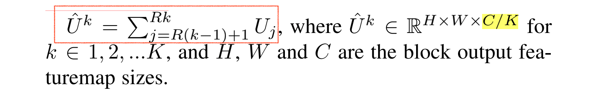
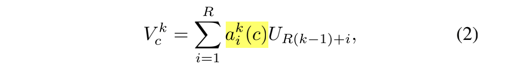

# ResNeSt

ResNeSt 的总结：

- ResNeXt
- SENet
- SKNet

ResNeSt integrates the channel wise attention with multi-path network representation.

## 3.1 Split-Attention Block

**Split-Attention block**: enables featuremap attention across different featuremap groups 

- featuremap group
- split attention

### Featuremap Group

在 ResNeXt 中，引入了一个超参数 K（cardinality），用于控制将特征图被分成多少组。

分成的特征图组被称为 *cardinal groups*。

在 ResNeSt 中，又引入了一个新的超参数 R（radix），用于控制将 cardinal group 进行多少次划分。

因此，特征图组的总数：G = KR。对每一个单独的组应用一系列变换 {F1, F2, ... FG}，那么每一个组的中间表示就是 Ui = Fi(X)，对于 i ∈ {1, 2, ... G}。


> （1）这个 c' 我感觉有点难以理解？
>
> - 最下面⊕之前有一个 [Conv, 1×1, c] 把通道数从 c' 升到了 c。因此如果不使用 c' 的话，就可以省略掉最后的 1×1 卷积。作者画的 SE Block 和 SK Block 就和原始论文不一样，以 SK block 为例，如果不使用 c‘，也就是说 c'=c，那么 Split Attention 之后就没有必要再进行 1×1 卷积了。
>
> - 代码实现中 c’ 等于多少呢？
>
>
> （2）进行分组卷积吗？分成 K 和 cardinal group，每个 cardinal group 输入的特征图通道数是 C？还是 C/K？
>
> - 答：论文后面有说到 ResNeSt 和 SENet、SKNet 的关系。提到将 split 分支即参数 R=2，每个 cardinal group 中的 Split-Attention block 就是和 SK-Net Attention。因此，输入每个 cardinal block 的特征图大小为 h×w×c。
>
>


### Split-Attention in Cardial Groups

解析 Split Attention 的内部细节。

**（1）element-wise summation across multiple splits**：将 cardinal group 内部的分支先进行元素求和。

将第 k 个 cardinal group 表示为：



如，第 1 个 cardinal group 表示为：

$\check{U}^{1} = \sum_{j = 1}^{R} U_{1}$

第 2 个表示为（有一种二维数组的感觉）：

$$\check{U}^{2} = \sum_{R+1}^{2R}$$

上限的最大值为 RK，表示特征图组的总数：G = KR。

（2）通过全局平均池化（global average pooling）来获得全局的上下文信息。


$S^k \in \mathbb{R}^{1 \times 1 \times C/K }$，是一个 C/K 的向量。

cardinal group 的加权融合：



- 


---

```python
def resnest50(pretrained=False, root='~/.encoding/models', **kwargs):
    model = ResNet(Bottleneck, [3, 4, 6, 3],
                   radix=2, groups=1, bottleneck_width=64,
                   deep_stem=True, stem_width=32, avg_down=True,
                   avd=True, avd_first=False, **kwargs)
    if pretrained:
        model.load_state_dict(torch.hub.load_state_dict_from_url(
            resnest_model_urls['resnest50'], progress=True, check_hash=True))
    return model

```


