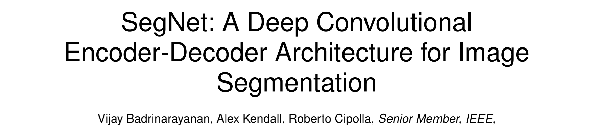
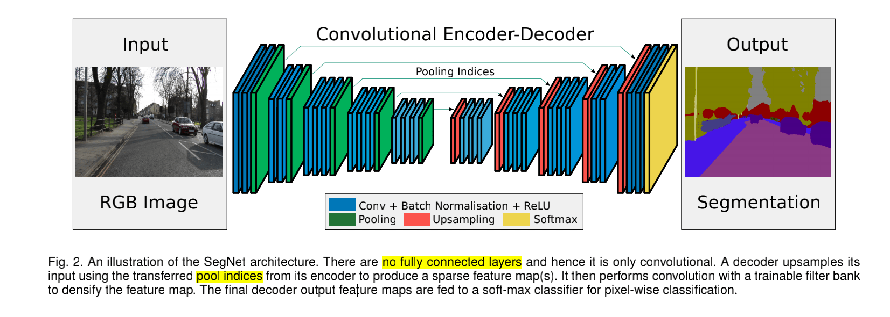
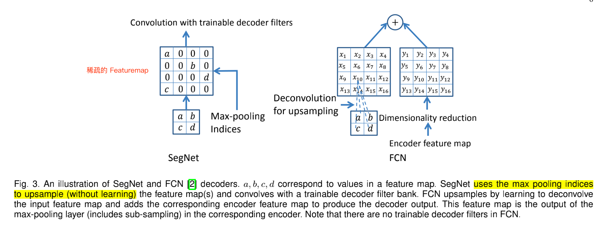
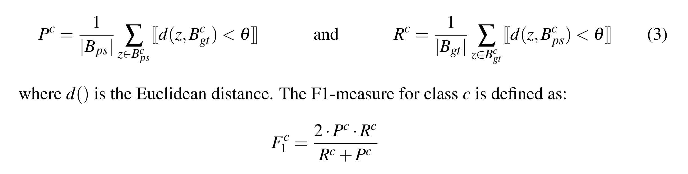
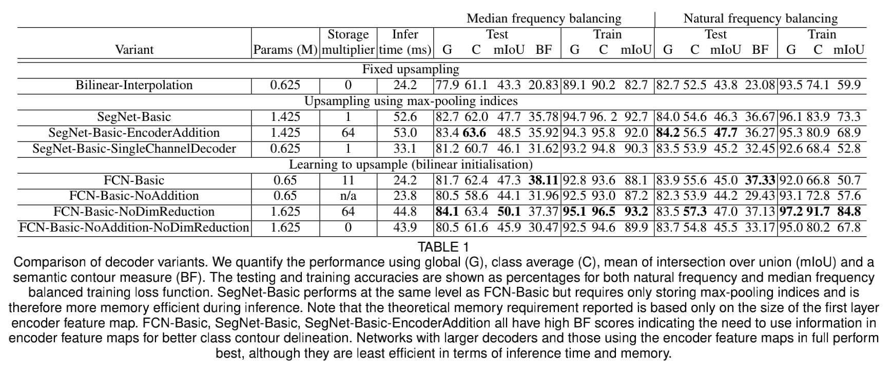
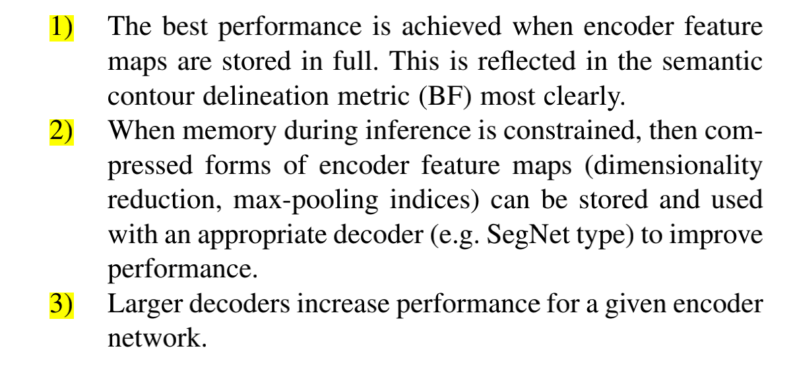

---

FCN：Fully Convolutional Networks for Semantic Segmentation

- https://arxiv.org/abs/1411.4038

U-Net：U-Net: Convolutional Networks for Biomedical Image Segmentation

- <https://arxiv.org/abs/1505.04597>

SegNet：SegNet: A Deep Convolutional Encoder-Decoder Architecture for Image Segmentation

- <https://arxiv.org/pdf/1511.00561.pdf>

---

## 概览

论文所要解决的问题：

<font color='blue'> encoder layer 的最大池化和子采样可以实现更多的平移不变性（translation invariance），以实现鲁棒分类，但相应地也存在特征图的**空间分辨率的损失**。</font>

<font color='red'>随着最大池化和子采样层的堆叠，边界细节丢失的有损特征图（空间分辨率损失），对边界划分至关重要的分割任务来说是不利的。</font>


因此，解决方案是：在 encoder 中进行降采样之前，先捕获并存储特征图中的一些信息。如果前向传播过程中的内存不受限制，那么可以存储所有的 encoder 每次降采样之间的所有特征图，这些特征图将用于指导升采样。

FCN、U-Net 采用的是将 encoder 每次降采样前的特征图全部存储，在 decoder layer 进行浅层特征和深层特征合并时，U-Net 使用的是拼接方法（Concatenation），而 FCN 使用的是求和。

由于内存的限制，本文提出了一种更有效的方式来存储这些信息。 它只存储最大池化索引（<font color='blue'>max-pooling indices</font>），即为每个编码器特征图记忆每个池化窗口中最大特征值的**位置索引**。


- > encoder 和 decoder：
  >
  > SegNet 将网络前面提取特征的部分称为编码器（Encoder），后面上采样的部分称为解码器（Decoder）。从这篇文献开始，encoder-decoder 开始广泛使用在分割任务中。（<font color='red'>可能</font>）
  >
  > encoder-decoder Hinton  2006 年 提出。
  >
  > https://www.cs.toronto.edu/~hinton/science.pdf

- decoder 与encoder 相对应。

- SegNet 的 decoder 使用从相应 encoder 保存下来的最大池化索引（max-pooling indices），用这个来指导输入的特征图进行非线性上采样。

- max-pooling indices 的优势：
  - (i) it improves boundary delineation.
  - (ii) it reduces the number of parameters enabling end-to-end training.（我表示怀疑！）
  - (iii) this form of upsampling can be incorporated into any encoder-decoder architecture with only a little modification.


## SegNet Architecture



SegNet 由 3 个主要组件：

（1）encoder network

（2）decoder network

（3）pixel-wise classification layer

去掉全连接的 VGG16 有 13 个卷积层。可以用在大数据集预训练好的参数进行初始化。VGG16 的参数量是 134M，去掉全连接层后的参数量为 14.7M。

```python
'vgg16': [64, 64, 'M', 128, 128, 'M', 256, 256, 256, 'M', 512, 512, 512, 'M', 512, 512, 512, 'M'],
```


每个编码器层都有相应的解码层，因此解码网络也有 13 层。最后的解码器的输出被送入 multi-class soft-max classififier 为每个像素独立产生类概率。


## max-pooling indices

由于内存的限制，本文提出了一种更有效的方式来存储 encoder 降采样前的特征图信息。 它只存储最大池化索引（<font color='blue'>max-pooling indices</font>）：每个池化窗口中最大值的**位置索引**。



对于输入的特征图，decoder 使用其相对应的 encoder 存储下来的 max-pooling indices 进行上采样。

上采样后得到稀疏的特征图，然后将这些特征图与可训练的 decoder 卷积核进行卷积，以产生密集的特征图。卷积之后是 Batch Normalization。

需要注意：对应于第一个 encoder（最接近输入图像）对应的 decoder 会产生一个多通道特征图（最后一个 decoder），尽管其 encoder 输入有 3 个通道（RGB）。网络中的其他 decoder 产生的特征图与其 encoder 输入的大小和通道数相同。


### 1 Boundary F1-measure (BF)

mIoU 倾向于区域平滑性，而**不评价边界精度**，这一点 FCN 的作者最近也提到了。

Boundary F1-measure (BF)：衡量边界轮廓的指标。对所有的 ground-truth 和 prediction 的轮廓（contour）点进行比较，计算准确率和召回率，得到 F1-score。轮廓不会完全精准，因此这里的准确指的是在一定容忍范围内的相等（tolerance distance）。

> The key idea in computing a semantic contour score is to evaluate the F1-measure [59] which involves computing the precision and recall values between the predicted and ground truth class boundary given a **pixel tolerance distance**. We used a value of 0.75% of the image diagonal as the tolerance distance. The F1-measure for each class that is present in the ground truth test image is averaged to produce an image F1-measure. Then we compute the whole test set average, denoted the boundary F1-measure (BF) by average the image F1 measures.
>
>
>
> Csurka, G., D. Larlus, and F. Perronnin. "What is a good evaluation measure for semantic segmentation?" Proceedings of the British Machine Vision Conference, 2013, pp. 32.1-32.11.


>
>
> 


- $B_{gt}^{c}$ ：be the boundary map of the binarized ground truth  segmentation map for class c.
- $B_{ps}^{c}$：is the contour map for the  binarized predicted segmentation map $S_{ps}^{c}$.

- θ is the distance error tolerance

> IoU = TP / (TP + FP + FN)
>
> P = TP / (TP + FP)
>
> R = TP / (TP + FN)


BF 的实现：<http://mi.eng.cam.ac.uk/projects/segnet/computeBFmeasure.m>


## Experiment



Decoder Variant

（1）<font color='blue'>SegNet-Basic</font>：4 encoder，4 decoder。

（2）<font color='blue'>SegNet-SingleChannelDecoder</font>：卷积核只有一个通道，大大减少了可训练参数的数量和推理时间（分组卷积）。

（3）<font color='blue'>FCN-Basic</font>：FCN-Basic 是与 SegNet-Basic 对应的 FCN 版本，共享相同的 Encoder 网络，而 Decoder 网络采用 FCN 所提出的结构。最后一个 encoder 将通道数降为 K。

（4）<font color='blue'>FCN-Basic-NoAddition</font>：一个 FCN-Basic 模型的变体，它摒弃 encoder 特征图添加步骤，只学习上采样核。因此，不需要存储 encoder 的特征图。 TABLE 1 中的 `n/a` 表示：“表格中本栏目(对我)不适用”。

（5）<font color='blue'>Bilinear-Interpolation</font>：使用固定的双线性插值权重来研究上采样，因此上采样不需要学习。（不太了解这个）

（6）<font color='blue'>SegNet-BasicEncoderAddition</font>：在每一层将 64 个 encoder 特征图添加到 SegNet decoder 的相应输出特征图中，以创建一个内存消耗更大的 SegNet 变体。（仿照 FCN，因为值存 64 个，因此通道数要少于 FCN，后面卷积时，卷积核的通道数也少一些，因此参数量少。1.425M  V.S. 1.625M）

（7）<font color='blue'>FCN-Basic-NoDimReduction</font>：一个更耗费内存的 FCN-Basic 变体，对 encoder 特征图不进行维度减少。


TABLE 1 的出的结论：




