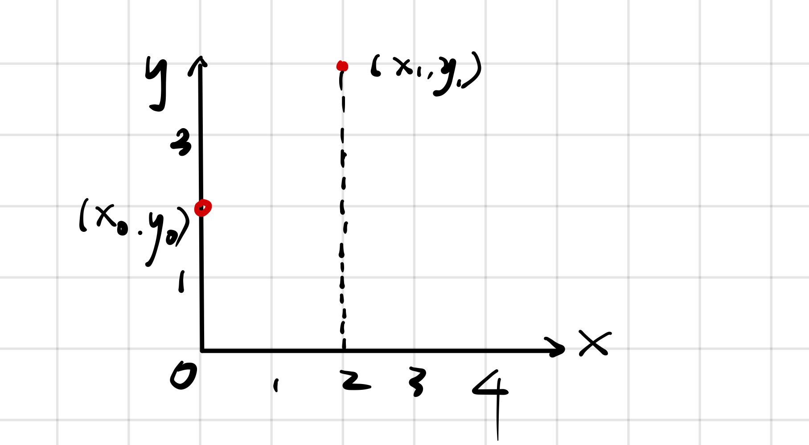
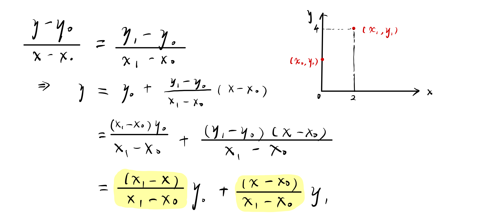
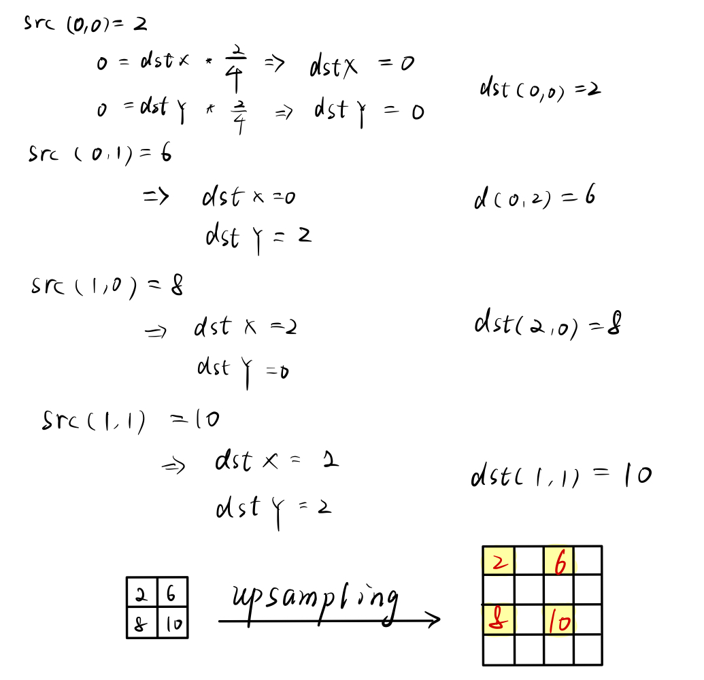

# 插值法

## 单线性插值法

即在一个方向上进行线性插值。

有两个点 $(x_0, y_0) = (0, 2), (x_1, y_1) = (2, 4)$，需要再 x=1 处进行线性插值，需要计算 y 的值。

通过 $(x_0, y_0), (x_1, y_1)$ 计算出直线方程，再将 x = 1 代入，可以求得 y。

沿着 y 方向同理。

对于一个 2×2 的特征图，使用单线性插值法得到 4×4 的特征图，应该怎么做？

对于 dst 空的像素，可以通过线性插值的方法进行求解。

bilinear upsampling

