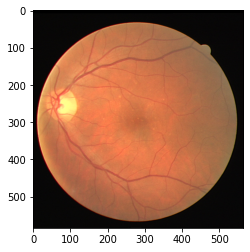
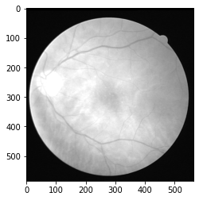
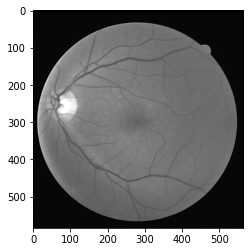
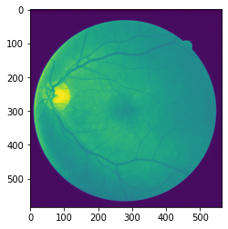
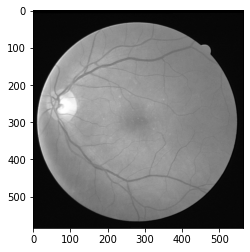
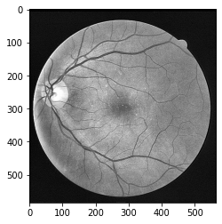
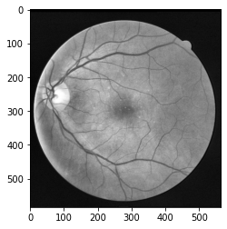

# 数据预处理


```python
import matplotlib.pyplot as plt
import glob
from PIL import Image
import numpy as np
import cv2
```


```python
# 训练集图像
img_paths = glob.glob('./../data/vesselseg/DRIVE/training/images/*.tif')
```


```python
img_paths.sort()
img_paths
```


    ['./../data/vesselseg/DRIVE/training/images/21_training.tif',
     './../data/vesselseg/DRIVE/training/images/22_training.tif',
     './../data/vesselseg/DRIVE/training/images/23_training.tif',
     './../data/vesselseg/DRIVE/training/images/24_training.tif',
     './../data/vesselseg/DRIVE/training/images/25_training.tif',
     './../data/vesselseg/DRIVE/training/images/26_training.tif',
     './../data/vesselseg/DRIVE/training/images/27_training.tif',
     './../data/vesselseg/DRIVE/training/images/28_training.tif',
     './../data/vesselseg/DRIVE/training/images/29_training.tif',
     './../data/vesselseg/DRIVE/training/images/30_training.tif',
     './../data/vesselseg/DRIVE/training/images/31_training.tif',
     './../data/vesselseg/DRIVE/training/images/32_training.tif',
     './../data/vesselseg/DRIVE/training/images/33_training.tif',
     './../data/vesselseg/DRIVE/training/images/34_training.tif',
     './../data/vesselseg/DRIVE/training/images/35_training.tif',
     './../data/vesselseg/DRIVE/training/images/36_training.tif',
     './../data/vesselseg/DRIVE/training/images/37_training.tif',
     './../data/vesselseg/DRIVE/training/images/38_training.tif',
     './../data/vesselseg/DRIVE/training/images/39_training.tif',
     './../data/vesselseg/DRIVE/training/images/40_training.tif']


## 查看不同通道


```python
# 读取其中一张图像
rgb_img = Image.open(img_paths[0])
```


```python
rgb_img.size
```


    (565, 584)


```python
plt.imshow(rgb_img)
```


    <matplotlib.image.AxesImage at 0x7fb39515ed68>


​    

​    


```python
rgb_img = np.asarray(rgb_img)
print(rgb_img.shape)
```

    (584, 565, 3)


```python
# Blue 通道
plt.imshow(rgb_img[:,:,0], cmap="gray")
```


    <matplotlib.image.AxesImage at 0x7fb392b4b438>


​    

​    


```python
# Green 通道
plt.imshow(rgb_img[:,:,1], cmap="gray")
```


    <matplotlib.image.AxesImage at 0x7fb392c09518>


​    

​    


```python
# Red 通道
plt.imshow(rgb_img[:,:,2], cmap="gray")
```


    <matplotlib.image.AxesImage at 0x7fb39578a128>


​    

​    


## 使用 Pillow 读取图片，并进行维度的转换


```python
rgb_img = Image.open(img_paths[0])
print(rgb_img.size)
# Convert the dimension of imgs to [N,H,W,C]
rgb_img = np.expand_dims(rgb_img,0)
print(rgb_img.shape)
# Convert the dimension of imgs to [N,C,H,W]
rgb_img = np.transpose(rgb_img,(0,3,1,2))
print(rgb_img.shape)
```

    (565, 584)
    (1, 584, 565, 3)
    (1, 3, 584, 565)


```python
#convert RGB image in black and white
def rgb2gray(rgb):
    assert (len(rgb.shape)==4)  #4D arrays
    assert (rgb.shape[1]==3)
    # 给 Green 通道对比度较高，给更大的权重
    bn_imgs = rgb[:,0,:,:]*0.299 + rgb[:,1,:,:]*0.587 + rgb[:,2,:,:]*0.114
    bn_imgs = np.reshape(bn_imgs,(rgb.shape[0],1,rgb.shape[2],rgb.shape[3]))
    return bn_imgs
```


```python
gray_img = rgb2gray(rgb_img)
```


```python
# 明明已经是单通道了，为什么还是彩色的？
plt.imshow(gray_img[0,0,:,:])
```


    <matplotlib.image.AxesImage at 0x7fb392c29160>


​    

​    


```python
plt.imshow(gray_img[0,0,:,:], cmap="gray")
```


    <matplotlib.image.AxesImage at 0x7fb395915d30>


​    

​    


## 数据标准化


```python
def dataset_normalized(imgs):
    assert (len(imgs.shape)==4)  #4D arrays
    assert (imgs.shape[1]==1)  #check the channel is 1
    imgs_normalized = np.empty(imgs.shape)
    imgs_std = np.std(imgs)
    imgs_mean = np.mean(imgs)
    imgs_normalized = (imgs-imgs_mean)/imgs_std
    for i in range(imgs.shape[0]):
        imgs_normalized[i] = ((imgs_normalized[i] - np.min(imgs_normalized[i])) / (np.max(imgs_normalized[i])-np.min(imgs_normalized[i])))*255
    return imgs_normalized
```


```python
img_norm = dataset_normalized(gray_img)
```


```python
img_norm.shape
```


    (1, 1, 584, 565)


```python
plt.imshow(img_norm[0,0,:,:], cmap="gray")
```


    <matplotlib.image.AxesImage at 0x7fb397b4b2b0>


​    

​    


## 限制对比度直方图均衡化(CLAHE)，在抑制噪声的同时提升血管与背景的对比度


```python
# CLAHE (Contrast Limited Adaptive Histogram Equalization)
#adaptive histogram equalization is used. In this, image is divided into small blocks called "tiles" (tileSize is 8x8 by default in OpenCV). Then each of these blocks are histogram equalized as usual. So in a small area, histogram would confine to a small region (unless there is noise). If noise is there, it will be amplified. To avoid this, contrast limiting is applied. If any histogram bin is above the specified contrast limit (by default 40 in OpenCV), those pixels are clipped and distributed uniformly to other bins before applying histogram equalization. After equalization, to remove artifacts in tile borders, bilinear interpolation is applied
def clahe_equalized(imgs):
    assert (len(imgs.shape)==4)  #4D arrays
    assert (imgs.shape[1]==1)  #check the channel is 1
    #create a CLAHE object (Arguments are optional).
    clahe = cv2.createCLAHE(clipLimit=2.0, tileGridSize=(8,8))
    imgs_equalized = np.empty(imgs.shape)
    for i in range(imgs.shape[0]):
        imgs_equalized[i,0] = clahe.apply(np.array(imgs[i,0], dtype = np.uint8))
    return imgs_equalized
```


```python
img_clahe = clahe_equalized(img_norm)
```


```python
img_clahe.shape
```


    (1, 1, 584, 565)


```python
plt.imshow(img_clahe[0,0,:,:], cmap="gray")
```


    <matplotlib.image.AxesImage at 0x7fb398bedf28>


​    

​    


## 经 filter 滤波对图像进行全局锐化，抑制 CLAHE 增强后图像的伪影与黄斑等噪声影响，突显血管信息


```python
# laplacian kernle
K = [[0., 1., 0.],[1., -4., 1.], [0., 1., 0.]]
```


```python
# Image sharpening by laplacian filter

def laplacian_sharpening(img, K_size=3):
    
    H, W = img.shape[2], img.shape[3]
    # zero padding
    pad = K_size // 2
    out = np.zeros((H + pad * 2, W + pad * 2), dtype=np.float)
    out[pad: pad + H, pad: pad + W] = img.copy().astype(np.float)
    tmp = out.copy()
    
    # laplacian kernle
    K = [[0., 1., 0.],[1., -4., 1.], [0., 1., 0.]]
    
    # filtering and adding image -> Sharpening image
    for y in range(H):
        for x in range(W):
            # core code
            out[pad + y, pad + x] = (-1) * np.sum(K * (tmp[y: y + K_size, x: x + K_size])) + tmp[pad + y, pad + x]

    out = np.clip(out, 0, 255)
    out = out[pad: pad + H, pad: pad + W].astype(np.uint8)

    return out
```


```python
img_sharp = laplacian_sharpening(img_clahe)
```


```python
img_sharp.shape
```


    (584, 565)


```python
plt.imshow(img_sharp[:,:], cmap='gray')
```


    <matplotlib.image.AxesImage at 0x7fb39810f9b0>


​    

​    


## 利用局部自适应 Gamma 矫正


```python
def adjust_gamma(imgs, gamma=1.0):
    assert (len(imgs.shape)==4)  #4D arrays
    assert (imgs.shape[1]==1)  #check the channel is 1
    # build a lookup table mapping the pixel values [0, 255] to
    # their adjusted gamma values
    invGamma = 1.0 / gamma
    table = np.array([((i / 255.0) ** invGamma) * 255 for i in np.arange(0, 256)]).astype("uint8")
    # apply gamma correction using the lookup table
    new_imgs = np.empty(imgs.shape)
    for i in range(imgs.shape[0]):
        new_imgs[i,0] = cv2.LUT(np.array(imgs[i,0], dtype = np.uint8), table)
    return new_imgs
```


```python
img_gamma = adjust_gamma(img_clahe) 
```


```python
plt.imshow(img_gamma[0,0,:,:], cmap='gray')
```


    <matplotlib.image.AxesImage at 0x7fb39993ba20>


​    

​    


```python
  
# Reading the image named 'input.jpg'
input_image = cv2.imread(img_paths[0])
input_image = cv2.cvtColor(input_image, cv2.COLOR_BGR2GRAY)
```


```python
# Getting the kernel to be used in Top-Hat
filterSize =(3, 3)
kernel = cv2.getStructuringElement(cv2.MORPH_RECT, 
                                   filterSize)

# Applying the Top-Hat operation
tophat_img = cv2.morphologyEx(img_gamma[0,0,:,:], 
                              cv2.MORPH_TOPHAT,
                              kernel)
```


```python
plt.imshow(img_gamma[0,0,:,:] - tophat_img, cmap='gray')
```


    <matplotlib.image.AxesImage at 0x7fb39ba39f28>


​    

​    
