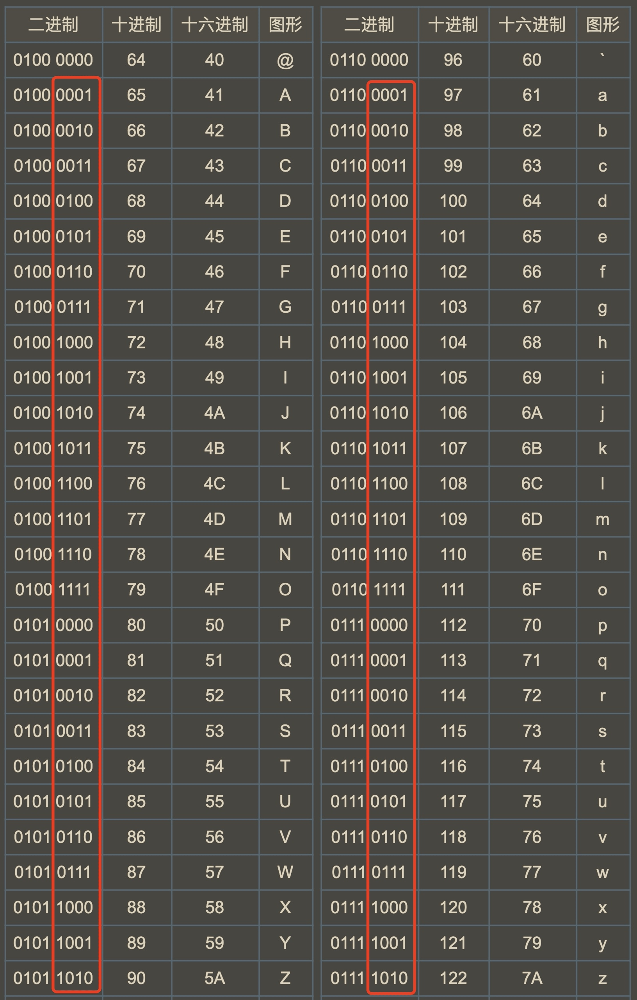

# ASCII 大写转小写

这下把 ASCII CODE 大小写字母所对应的二进制彻底搞懂了！请注意它们相同和不同的地方。





> 实现函数 ToLowerCase()，该函数接收一个字符串参数 str，并将该字符串中的大写字母转换成小写字母，之后返回新的字符串。

```python
class Solution:
    def toLowerCase(self, str: str) -> str:
        return "".join(chr(ord(c)|32) for c in str)
```

