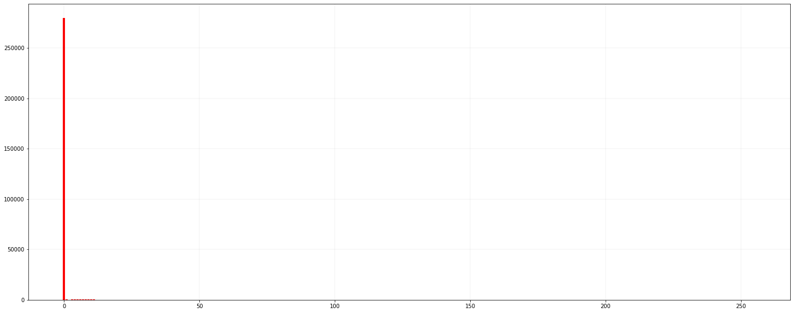
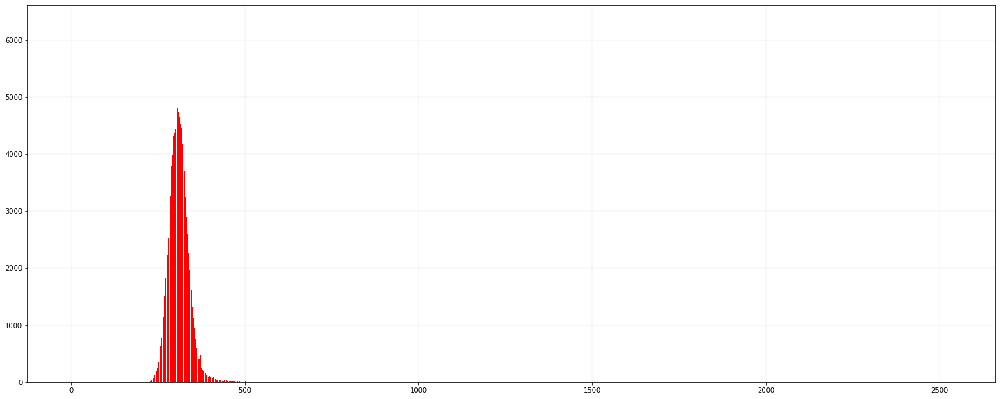
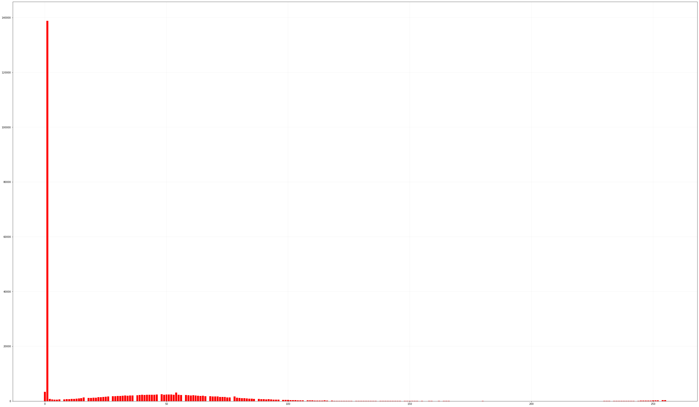

```python
!ls
```

    Histogram and RoI.ipynb axon02.tif              test.jpg
    Question 2.1 .ipynb     cell_nucleus.tif
    axon01.tif              roi.tif


```python
from PIL import Image
import numpy as np
from PIL import ImageOps
import matplotlib.pyplot as plt
```


```python
# 打开图片并转换成灰度图
im = Image.open('axon01.tif').convert('L')
```


```python
# 反转颜色
im = ImageOps.invert(im)
```


```python
# display in macOS /Applications/Preview.app
# im.show()

# display in Jupyter Notebook
im
```


​    

​    


```python
# 将灰度图片转换为 Numpy Array
im2array = np.array(im)
```


```python
im2array.shape
```


    (204, 1392)


```python
# 将矩阵转化为向量
im2array = im2array.flatten()
```


```python
# 204*1392 = 283968
len(im2array)
```


    283968


```python
# 统计灰度值频率
freq = [0]*256
for i in range(len(im2array)):
    freq[im2array[i]] += 1
```


```python
# 绘制灰度频率直方图
plt.figure(figsize=(25,10))
for i in range(0, 256):
    plt.bar(i, freq[i], color='r')
    plt.grid(color='gray', linewidth=0.1)
```


​    

​    


```python
# 左上角坐标(0,0)，右下角下标(100,100)
# 裁剪出 100*100 的区域
box = (0, 0, 100, 100)
region = im.crop(box)
```


```python
# 保存
region.save('roi.tif')
```


```python
# 读取保存的 RoI
roi_im = Image.open('./roi.tif')
```


```python
roi_im.size
```


    (100, 100)


```python

```


```python
# 不转换为灰度图片
im = Image.open('axon01.tif')
im2array = np.array(im)
im2array = im2array.flatten()

# 统计像素值对应的像素个数
hist = [0] * (np.max(im2array)+1)
for i in range(0, len(im2array)):
    hist[im2array[i]] += 1
```


```python
# 绘制直方图
plt.figure(figsize=(25,10))
for i in range(0, np.max(im2array)):
    plt.bar(i, hist[i], color='r')
    plt.grid(color='gray', linewidth=0.1)
```


​    

​    


## 使用 Pillow 库绘制直方图


```python
# 求[0,255]像素频率
histogram = im.histogram()
```


```python
# 这个分布符合直觉，大部分都是黑色
print(histogram)
```

    [3341, 138883, 751, 581, 499, 536, 582, 11, 645, 687, 717, 774, 800, 895, 946, 1071, 1367, 6, 1131, 1178, 1212, 1256, 1384, 1407, 1491, 1548, 1649, 5, 1726, 1760, 1855, 1869, 1982, 2007, 1993, 2027, 2069, 3, 2161, 2230, 2316, 2194, 2337, 2293, 2304, 2316, 2427, 6, 2474, 2341, 2359, 2380, 2380, 2301, 3120, 2300, 2175, 1, 2208, 2151, 2059, 2089, 2068, 1994, 1891, 1957, 1775, 3, 1753, 1725, 1676, 1718, 1527, 1527, 1490, 1361, 1281, 4, 1718, 1254, 1101, 1092, 1027, 974, 894, 896, 796, 3, 820, 727, 720, 650, 670, 585, 548, 498, 487, 1, 442, 400, 387, 335, 339, 345, 293, 279, 220, 4, 235, 224, 227, 189, 196, 173, 165, 244, 147, 3, 118, 113, 109, 109, 109, 110, 98, 74, 76, 2, 75, 77, 74, 69, 73, 57, 75, 67, 56, 2, 57, 44, 63, 57, 47, 36, 38, 35, 40, 1, 43, 28, 41, 29, 34, 34, 26, 33, 21, 1, 35, 32, 8, 22, 38, 19, 34, 32, 33, 0, 20, 22, 10, 26, 16, 19, 11, 21, 12, 1, 23, 12, 29, 20, 10, 13, 7, 11, 19, 1, 18, 14, 6, 18, 13, 13, 9, 14, 10, 2, 10, 11, 13, 12, 10, 9, 11, 14, 4, 1, 15, 13, 12, 15, 10, 3, 11, 9, 9, 4, 14, 14, 15, 17, 16, 15, 19, 18, 16, 15, 19, 25, 34, 35, 32, 9, 45, 49, 54, 47, 65, 85, 101, 108, 92, 5, 102, 149, 141, 157, 185, 201, 207, 222, 275, 6, 318, 297]


```python
# 最大值 138883 表示有 138883 个值为 1的像素
max(histogram)
```


    138883


```python
for i, value in enumerate(im.histogram()):
    print(i, value)
```

    0 3341
    1 138883
    2 751
    3 581
    4 499
    5 536
    6 582
    7 11
    8 645
    9 687
    10 717
    11 774
    12 800
    13 895
    14 946
    15 1071
    16 1367
    17 6
    18 1131
    19 1178
    20 1212
    21 1256
    22 1384
    23 1407
    24 1491
    25 1548
    26 1649
    27 5
    28 1726
    29 1760
    30 1855
    31 1869
    32 1982
    33 2007
    34 1993
    35 2027
    36 2069
    37 3
    38 2161
    39 2230
    40 2316
    41 2194
    42 2337
    43 2293
    44 2304
    45 2316
    46 2427
    47 6
    48 2474
    49 2341
    50 2359
    51 2380
    52 2380
    53 2301
    54 3120
    55 2300
    56 2175
    57 1
    58 2208
    59 2151
    60 2059
    61 2089
    62 2068
    63 1994
    64 1891
    65 1957
    66 1775
    67 3
    68 1753
    69 1725
    70 1676
    71 1718
    72 1527
    73 1527
    74 1490
    75 1361
    76 1281
    77 4
    78 1718
    79 1254
    80 1101
    81 1092
    82 1027
    83 974
    84 894
    85 896
    86 796
    87 3
    88 820
    89 727
    90 720
    91 650
    92 670
    93 585
    94 548
    95 498
    96 487
    97 1
    98 442
    99 400
    100 387
    101 335
    102 339
    103 345
    104 293
    105 279
    106 220
    107 4
    108 235
    109 224
    110 227
    111 189
    112 196
    113 173
    114 165
    115 244
    116 147
    117 3
    118 118
    119 113
    120 109
    121 109
    122 109
    123 110
    124 98
    125 74
    126 76
    127 2
    128 75
    129 77
    130 74
    131 69
    132 73
    133 57
    134 75
    135 67
    136 56
    137 2
    138 57
    139 44
    140 63
    141 57
    142 47
    143 36
    144 38
    145 35
    146 40
    147 1
    148 43
    149 28
    150 41
    151 29
    152 34
    153 34
    154 26
    155 33
    156 21
    157 1
    158 35
    159 32
    160 8
    161 22
    162 38
    163 19
    164 34
    165 32
    166 33
    167 0
    168 20
    169 22
    170 10
    171 26
    172 16
    173 19
    174 11
    175 21
    176 12
    177 1
    178 23
    179 12
    180 29
    181 20
    182 10
    183 13
    184 7
    185 11
    186 19
    187 1
    188 18
    189 14
    190 6
    191 18
    192 13
    193 13
    194 9
    195 14
    196 10
    197 2
    198 10
    199 11
    200 13
    201 12
    202 10
    203 9
    204 11
    205 14
    206 4
    207 1
    208 15
    209 13
    210 12
    211 15
    212 10
    213 3
    214 11
    215 9
    216 9
    217 4
    218 14
    219 14
    220 15
    221 17
    222 16
    223 15
    224 19
    225 18
    226 16
    227 15
    228 19
    229 25
    230 34
    231 35
    232 32
    233 9
    234 45
    235 49
    236 54
    237 47
    238 65
    239 85
    240 101
    241 108
    242 92
    243 5
    244 102
    245 149
    246 141
    247 157
    248 185
    249 201
    250 207
    251 222
    252 275
    253 6
    254 318
    255 297


```python
# 像素总数 283968 = 204*1392
np.sum(histogram)
```


    283968


```python
# 灰度级在 [0,255]
len(histogram)
```


    256


```python
plt.figure(figsize=(50,30))
for i in range(0, 256):
    plt.bar(i, histogram[i], color='r')
    plt.grid(color='gray', linewidth=0.1)
```


​    

​    


```python

```
